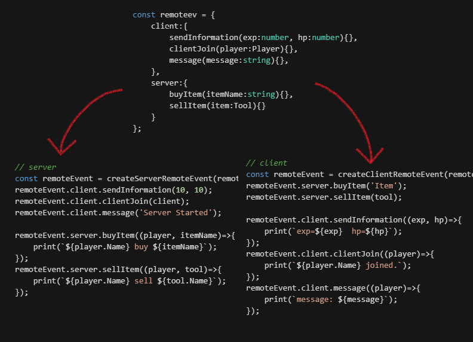

# Definations TO Implements!


# Reference

## createServerRemoteEvents Function
Parameter - `args:{client:FunctionObjects, server:FunctionObjects}`  
Remote Event Definations

Convert remote event Definations to functions.  
Definations are needed to define with empty functions.  
It will creates `RemoteEvent` to `ReplicatedStorage/rbx-remoteevent/*`.  
client functions will be [ServerRemoteSender](#methods-of-serverremotesender-class) class objects.  
server functions will be `OnClientEvent:Connection` functions.  

## createClientRemoteEvents Function
**This is a yielding function.**  
It will **WAITS** `RemoteEvent` creating of `createServerRemoteEvents`.  

Parameter - `args: {client:FunctionObjects, server:FunctionObjects}`  
Remote events Definations

Simmilar with `createServerRemoteEvents` but for client.  
client functions will be `FireServer` functions.
server functions will be `OnServerEvent:Connection` functions.

## Methods of ServerRemoteSender Class
* `fire(client, ...)` - send to one client  
* `fireAll(...)` - send to all clients  
* `fireWithout(client, ...)` - send to all without specific client  
* `fires(clientArray, ...)` - send to partial clients  

# Example
## common.ts
```typescript

// Define Remote Event Reference
export const remoteEventsDefinations = {
    client:{ // Server to Client
        youAre(a:number, b:string, c:boolean, name:string){},
        someoneJoined(a: number, b:string, c:boolean, name:string){},
    },
    server:{ // Client to Server
        whoAmI(a:number, b:string, c:boolean){}
    }
};

```

## client.ts
```typescript
import { createClientRemoteEvents } from "rbx-remoteevent";
import { remoteEventsDefinations } from "./common";

const remoteEvent = createClientRemoteEvents(remoteEventsDefinations);


// Receive from Server
remoteEvent.client.youAre((a, b, c, name)=>{
    print(`I'm ${name} (${a}, ${b}, ${tostring(c)})`);
});

// Send to Server
remoteEvent.server.whoAmI(math.random(), 'string', true);

```

## server.ts
```typescript
import { createServerRemoteEvents } from "rbx-remoteevent";
import { remoteEventsDefinations } from "./common";

const remoteEvent = createServerRemoteEvents(remoteEventsDefinations);


// Receive from Client
remoteEvent.server.whoAmI((player, a, b, c)=>{

    // Send to 'player'
    remoteEvent.client.youAre.fire(player, a, b, c, player.Name);

    // Send to All
    remoteEvent.client.someoneJoined.fireAll(a, b, c, player.Name);

    // Send to partial players
    const [p1, p2, p3] = game.GetService('Players').GetChildren();
    remoteEvent.client.someoneJoined.fires([p1, p2, p3], a, b, c, player.Name);

    // Send to All without 'player'
    remoteEvent.client.someoneJoined.fireWithout(player, a, b, c, player.Name);
});
```